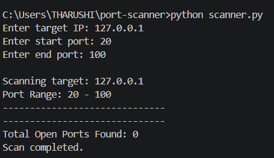
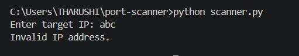
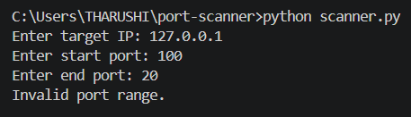

# Port Scanner

A simple Python-based TCP Port Scanner developed using the `socket` module. This project allows users to scan a specified range of TCP ports on a target IP address and identify which ports are open.

## Features

* Scan TCP ports on a target IP address
* User-defined target IP
* Custom start and end port range
* Displays open ports
* Counts the total number of open ports
* Input validation for IP addresses
* Port range validation
* Error handling for invalid input

## Technologies Used

* Python 3
* Socket Programming

## Project Structure

```
port-scanner/
│
├── scanner.py
├── README.md
├── .gitignore
└── screenshots/
```

## How to Run

1. Clone the repository

```bash
git clone https://github.com/Avish-Tharu/port-scanner.git
```

2. Open the project folder

```bash
cd port-scanner
```

3. Run the program

```bash
python scanner.py
```

## Example Output

```
Enter target IP: 127.0.0.1
Enter start port: 20
Enter end port: 100

Scanning target: 127.0.0.1
------------------------------
Total Open Ports Found: 0
Scan completed.
```

## Screenshots

### Successful Scan



### Invalid IP



### Invalid Port Range



## Learning Outcomes

This project helped me learn:

* Python socket programming
* TCP networking fundamentals
* Port scanning concepts
* User input handling
* Exception handling
* Input validation
* Git and GitHub workflow

## Disclaimer

This project was developed for educational purposes only.

Only scan systems that you own or have permission to test.
